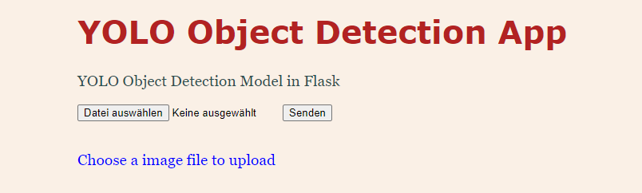
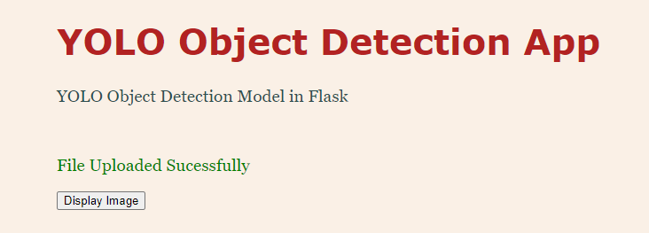
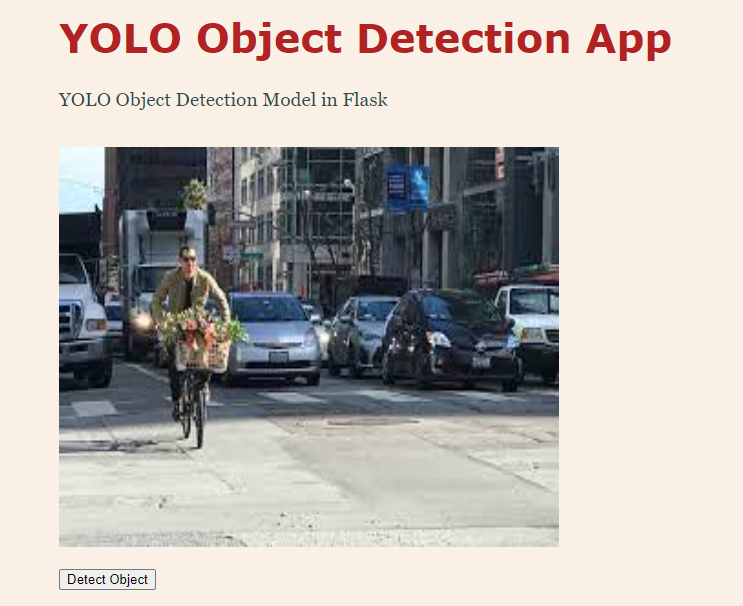
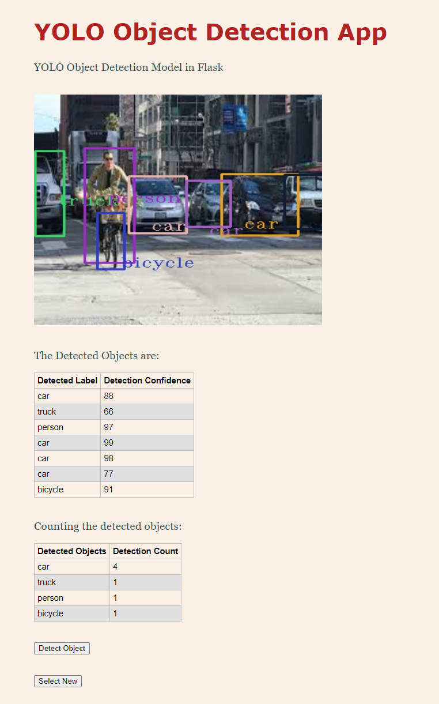

## Object Detection App based on Flask in Docker

This a simple Object Detection App working on browser using Flask and YOLOv3. The user can select any image and the app will visualise an image with results together with a list of detected objects and a counter showing the total number of deteted objects. 

The object detection based on YOLOv3

- #### Model Used
 YOLOv3 320x320 from Darknet 
 Weights are available at [YOLOv3 Weights](https://pjreddie.com/darknet/yolo/)
 
 The configuration file used from [cfg File](https://github.com/pjreddie/darknet/blob/master/cfg/yolov3.cfg)
 The labels for COCO are used from [coco names](https://raw.githubusercontent.com/pjreddie/darknet/master/data/coco.names)

 **Note** Download the model weights and save it under `data/model/` as `yolov3.weights` before running the App

### Dependencies

Making the app run locally, the dependencies shall be created in a virtual enviorment as follows:

#### Using on Anaconda

Create an enviorment for the app using 

`conda env create -f environment.yml`

The complete enviorment is listed under the file `environment_all.yml`

#### Using on virtualenvs

Create the virtual enviorment and install the required libraries from `requirements.txt` 

`pip install -r requirements.txt`

### API Calls

- `/show_image`

Used to visualise the uploaded image

- `/detect_object`

Used to perform object detection using YOLOv3

### Running the App

Run the app in Debug Mode

`flask --app flask_object_detection_app --debug run`

OR

`python flask_object_detection_app.py`

### Running the App in Docker

1. Build the Docker Image

Build the image with  `docker build -t odapp .`

2. Run the app in Docker
After sucessful building, run the docker `docker run -ti --rm -p 5000:5000 odapp`

and open a browser in the host machine `http://localhost:5000/` to visualise the app.

## App Views:

### Page1: Landing page

You can select the image in this page

### Page 2 Confirmation message on sucessful upload 

### Page 3 Visualise the uploaded image

### Page 4: Perform Object Detection, counting and visualise the results

#### Reference

Developed from the tutorial from [Thinkinfi](https://thinkinfi.com/yolo-object-detection-using-python-opencv/)
